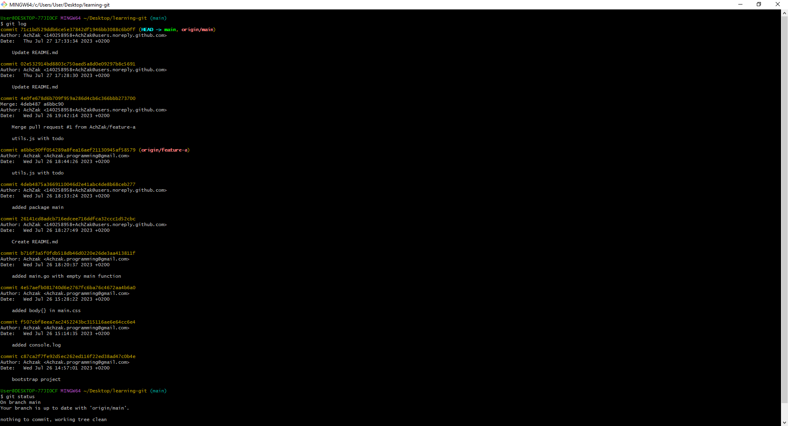

# Git and GitHub Essentials :octocat:

Welcome to the "Learning Git and GitHub" repository! :rocket:

This repository summarizes the concepts I've learned in my journey with Git and GitHub, essential tools for modern software development. :computer:

## :star2: Key Topics

### 💾 Git Basics

Git is a distributed version control system that enables effective code management and collaboration. Here are the essentials to get started:

- **Version Control**: Understand why version control is crucial for collaborative software development.

- **Getting Started**: Learn how to initialize a Git repository and make your first commit.

### 🔁 Most Important Git Commands

Discover essential Git commands for efficient version control:

- **Cloning a Repository**: Create a local copy of a remote Git repository using `git clone`.

- **Committing Changes**: Save your changes with `git commit`.

- **Synchronizing with Remote**: Fetch changes with `git pull` and push your changes with `git push`.

### 🔃 Branching and Merging

Understand branching and merging in Git:

- **Branch Creation**: Create branches with `git checkout -b <branch_name>`.

- **Merging Branches**: Merge branches using `git merge`.

- **Rebasing Branches**: Integrate changes from one branch into another with `git rebase`.

### 📌 Pull Requests

Learn how to create, manage, and review pull requests:

- **Creating a Pull Request**: Propose changes and additions with pull requests.

- **Reviewing a Pull Request**: Review and provide feedback on pull requests.

- **Merging a Pull Request**: Merge approved pull requests into the main branch.

### 🔧 Git Configuration

Customize your Git environment:

- **User Settings**: Set up your username and email for Git commits.

- **Aliases**: Create shortcuts for frequently used Git commands.

- **Gitignore**: Exclude unnecessary files and directories from version control.

## :bookmark_tabs: Git Workflow

In collaborative software development, an effective Git workflow is essential:

1. **Feature Branching**: Develop new features or fix bugs in feature branches for clean code isolation.

2. **Branch Naming**: Use clear and consistent branch naming conventions.

3. **Pull Requests**: Implement pull requests for code review and testing before integration.

4. **Code Reviews**: Conduct thorough code reviews to maintain quality.

5. **Continuous Integration (CI)**: Set up CI/CD pipelines for automated testing and deployments.

6. **Version Tagging**: Use Git tags to mark important project milestones.

7. **Documentation**: Keep documentation up to date for a smooth onboarding process.

8. **Conflict Resolution**: Resolve conflicts promptly through open communication.

9. **Git Hooks**: Implement Git hooks for pre-commit and pre-push checks.

10. **Gitignore**: Use `.gitignore` to exclude unnecessary files.

## :triangular_ruler: Importance of Using Terminal and Git Bash

Using the terminal or Git Bash as your primary interface for Git offers several advantages over GUI (Graphical User Interface) clients. While GUI clients can be user-friendly and visually appealing, the command-line interface provides a more powerful and efficient way to interact with Git. Here's why it's important:

### :computer: Efficiency and Speed

- **Faster Workflow**: Command-line Git commands are often faster than their GUI counterparts, allowing you to perform actions more quickly.

- **Batch Operations**: The terminal excels at executing batch operations, making it easier to automate tasks, such as committing changes to multiple repositories.

### :wrench: Full Control

- **Granular Control**: Command-line Git provides fine-grained control over your repositories. You can configure Git precisely to your needs.

- **Advanced Operations**: Some advanced Git operations, like interactive rebasing, require command-line usage.

### :recycle: Consistency

- **Cross-Platform**: Terminal Git works consistently across different operating systems, ensuring a consistent experience regardless of your development environment.

### :books: Learning Opportunity

- **Deeper Understanding**: Using the terminal or Git Bash allows you to gain a deeper understanding of Git's inner workings, which can be invaluable when troubleshooting issues.

### :triangular_flag_on_post: Git Bash for Windows

- **Unix-like Environment**: Git Bash on Windows provides a Unix-like command line, making it easier to work in cross-platform environments.

- **Compatibility**: When collaborating with developers using Unix-based systems, Git Bash ensures a smoother workflow by providing a common interface.

While GUI clients have their place and can be more accessible for beginners, becoming proficient in the command line and Git Bash can enhance your Git skills and make you more versatile as a developer. It's a valuable skill to have in your toolkit.

## :dart: Future Goals

- Build and contribute to open-source Java projects.
- Participate in hackathons and coding challenges to sharpen my skills.
- Collaborate with fellow developers on interesting projects.
- Continue learning and expanding my Java knowledge.

## :camera_flash: Screenshots

<table align="center">
  <tr>
    <td align="center">Diagram illustrating Git operations</td>
  </tr>
  <tr>
    <td align="center"></td>
  </tr>
</table>

<table align="center">
  <tr>
    <td align="center">Diagram illustrating Git workflow with a main and feature branch</td>
  </tr>
  <tr>
    <td align="center"></td>
  </tr>
</table>

<table align="center">
  <tr>
    <td align="center">GitHub Desktop example, a GUI Client for Git</td>
  </tr>
  <tr>
    <td align="center"></td>
  </tr>
</table>

<table align="center">
  <tr>
    <td align="center">Git Bash Commands</td>
  </tr>
  <tr>
    <td align="center"></td>
  </tr>
</table>

